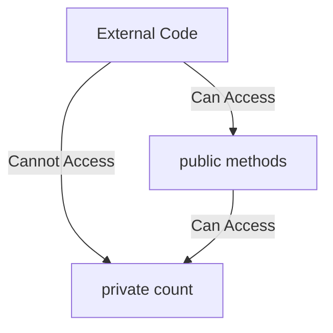
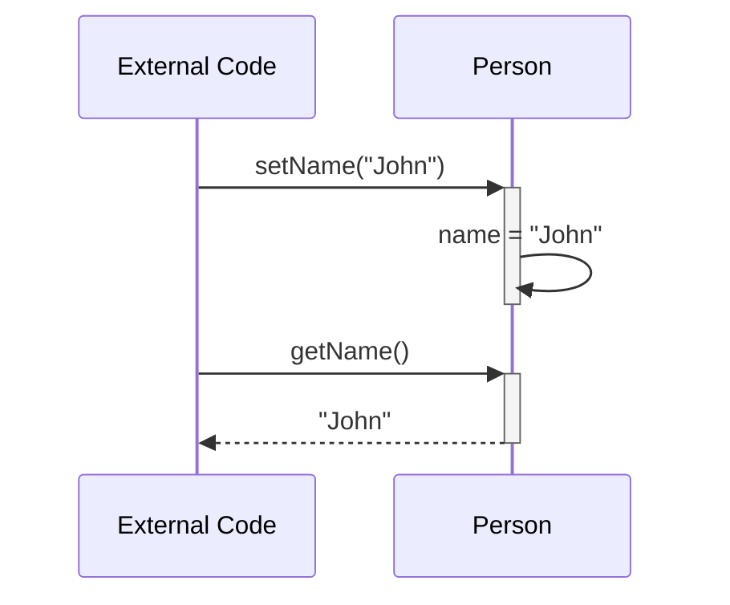
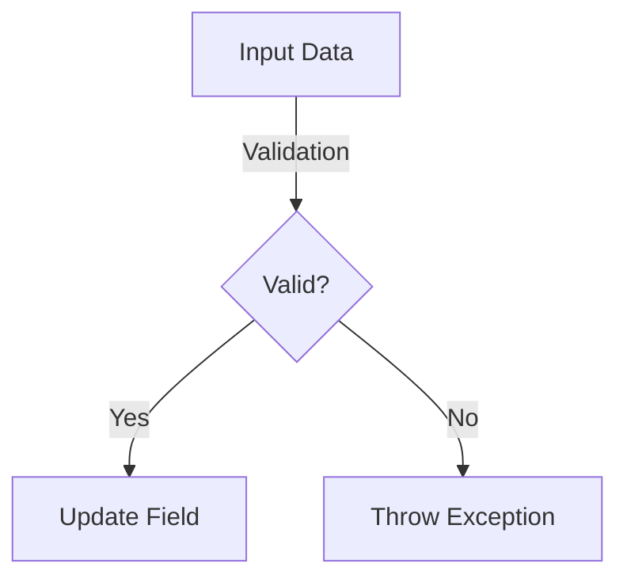
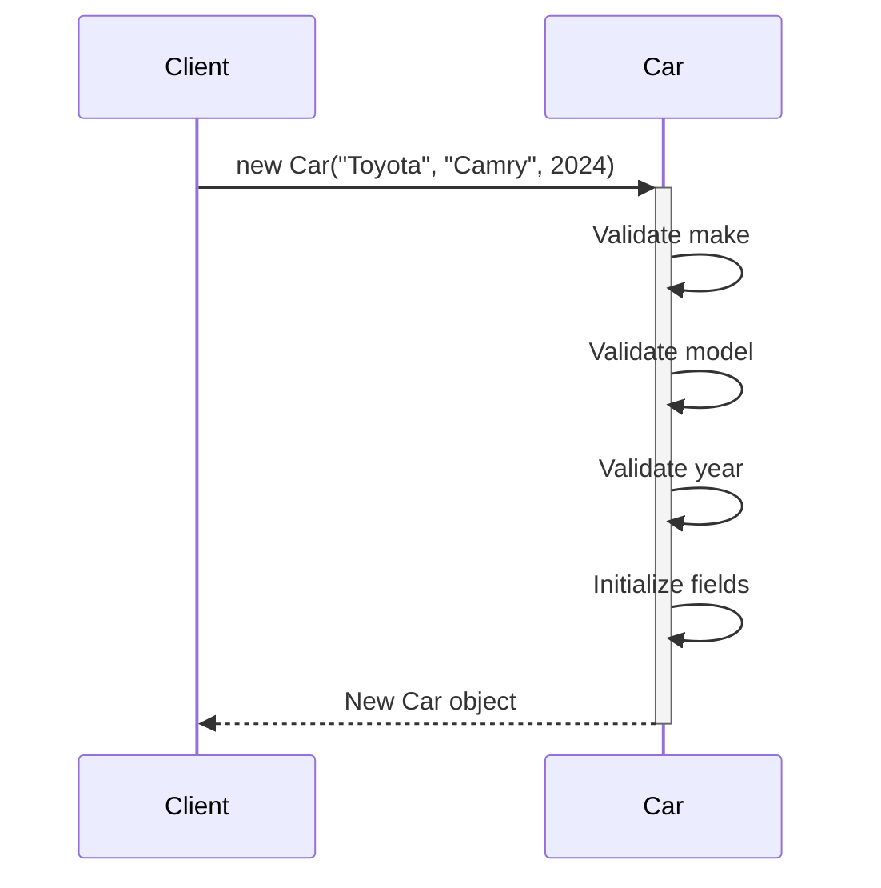
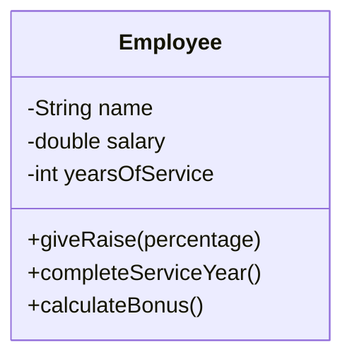
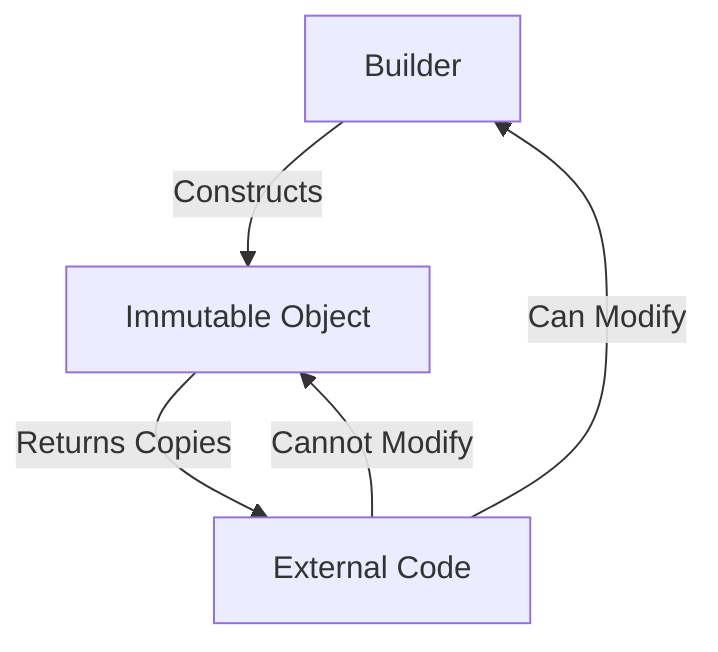

# Java Encapsulation Lab

## Table of Contents
1. [Basic Data Hiding](#1-basic-data-hiding)
2. [Getters and Setters](#2-getters-and-setters)
3. [Data Validation](#3-data-validation)
4. [Constructors and Initialization](#4-constructors-and-initialization)
5. [Business Logic Methods](#5-business-logic-methods)
6. [Advanced Encapsulation Patterns](#6-advanced-encapsulation-patterns)

## Lab Setup
Create a package called `ie.atu.encapsulation`. Place all the below classes into this package.

## 1. Basic Data Hiding

### Learning Objective
Learn how to hide data using private access modifiers and understand why it's important for building robust applications.

### Explanation
Data hiding is the fundamental concept of encapsulation where we restrict direct access to certain components of an object, typically by making fields private. This protection prevents unauthorized access to internal data and helps maintain the object's state consistency. By controlling access to our object's data, we can ensure that the object's state is always valid and can't be corrupted by external code.

### Example
```java
public class Counter {
    private int count; // Private field - cannot be accessed directly from outside
    
    public void increment() {
        count++;
    }
    
    public void displayCount() {
        System.out.println("Current count: " + count);
    }
}
```

### Visual Representation


### DIY Exercise: Secret Message
Create a `SecretMessage` class that:
- Has a private String field to store a message
- Has a method to display the message
- Does NOT allow direct access to the message field

## 2. Getters and Setters

### Learning Objective
Learn how to provide controlled access to private fields using getter and setter methods.

### Explanation
While private fields prevent direct access, we often need controlled ways to read and modify their values through getter and setter methods. Getter methods allow read access to private fields while maintaining encapsulation, and setter methods provide a way to modify private fields with proper validation. This approach gives us the flexibility to change how we store and validate data without affecting code that uses our class.

### Example
```java
public class Person {
    private String name;
    
    // Getter method
    public String getName() {
        return name;
    }
    
    // Setter method
    public void setName(String name) {
        this.name = name;
    }
}
```

### Visual Representation


### DIY Exercise: Temperature Converter
Create a `Temperature` class that:
- Stores temperature in Celsius (private)
- Provides getter methods for both Celsius and Fahrenheit
- Provides a setter method that accepts Celsius values

## 3. Data Validation

### Learning Objective
Learn how to validate data in setter methods to maintain data integrity.

### Explanation
Data validation is crucial for maintaining the integrity and reliability of our objects' state. By validating input before allowing changes to our private fields, we can prevent invalid states and ensure our objects behave correctly. Proper validation in setters helps catch errors early and provides clear feedback about what went wrong.

### Example
```java
public class BankAccount {
    private double balance;
    
    public double getBalance() {
        return balance;
    }
    
    public void deposit(double amount) {
        if (amount <= 0) {
            throw new IllegalArgumentException("Deposit amount must be positive");
        }
        balance += amount;
    }
    
    public void withdraw(double amount) {
        if (amount <= 0) {
            throw new IllegalArgumentException("Withdrawal amount must be positive");
        }
        if (amount > balance) {
            throw new IllegalArgumentException("Insufficient funds");
        }
        balance -= amount;
    }
}
```

### Visual Representation


### DIY Exercise: Grade Book
Create a `Grade` class that:
- Stores a numeric grade (0-100)
- Validates that grades are within valid range
- Throws an exception for invalid grades
- Provides a method to get the letter grade (A: 90-100, B: 80-89, etc.)

## 4. Constructors and Initialization

### Learning Objective
Learn how to properly initialize encapsulated objects using constructors.

### Explanation
Constructors ensure that objects are created in a valid state by properly initializing all necessary fields. A well-designed constructor validates its parameters and establishes class invariants, preventing the creation of invalid objects. The constructor represents the first line of defense in maintaining encapsulation, as it controls how objects are created and initialized.

### Example
```java
public class Car {
    private String make;
    private String model;
    private int year;
    
    // Constructor with validation
    public Car(String make, String model, int year) {
        if (make == null || make.trim().isEmpty()) {
            throw new IllegalArgumentException("Make cannot be empty");
        }
        if (model == null || model.trim().isEmpty()) {
            throw new IllegalArgumentException("Model cannot be empty");
        }
        if (year < 1886) { // First automobile was invented in 1886
            throw new IllegalArgumentException("Invalid year");
        }
        
        this.make = make;
        this.model = model;
        this.year = year;
    }
    
    // Getters
    public String getMake() { return make; }
    public String getModel() { return model; }
    public int getYear() { return year; }
}
```

### Visual Representation


### DIY Exercise: Book Catalog
Create a `Book` class that:
- Has private fields for ISBN, title, and author
- Has a constructor that validates all fields
- Provides only getter methods (immutable object)
- Throws exceptions for invalid input

## 5. Business Logic Methods

### Learning Objective
Learn how to implement methods that operate on encapsulated data while maintaining object consistency.

### Explanation
Business logic methods perform operations using the object's private data while maintaining encapsulation and data integrity. These methods encapsulate not just data but also the behavior and rules that apply to that data. By keeping business logic within the class, we ensure that all operations on the data follow the same rules and maintain consistency.

### Example
```java
public class Employee {
    private String name;
    private double salary;
    private int yearsOfService;
    
    // Constructor
    public Employee(String name, double salary) {
        this.name = name;
        this.salary = salary;
        this.yearsOfService = 0;
    }
    
    // Business logic methods
    public void giveRaise(double percentage) {
        if (percentage <= 0) {
            throw new IllegalArgumentException("Percentage must be positive");
        }
        salary += salary * (percentage / 100);
    }
    
    public void completeServiceYear() {
        yearsOfService++;
        if (yearsOfService % 5 == 0) {
            giveRaise(5); // 5% raise every 5 years
        }
    }
    
    public double calculateBonus() {
        return salary * (yearsOfService / 10.0);
    }
    
    // Getters
    public String getName() { return name; }
    public double getSalary() { return salary; }
    public int getYearsOfService() { return yearsOfService; }
}
```

### Visual Representation


### DIY Exercise: Bank Account Manager
Create an `Account` class that:
- Stores account balance and transaction history
- Implements deposit and withdrawal methods
- Calculates interest based on balance
- Provides account statement generation
- Tracks and limits daily transactions

## 6. Advanced Encapsulation Patterns

### Learning Objective
Learn advanced patterns for encapsulation including immutable objects and builder pattern.

### Explanation
Advanced encapsulation patterns provide additional ways to ensure object integrity and thread safety. Immutable objects are particularly useful as they guarantee that an object's state cannot be changed after creation, making them inherently thread-safe. The Builder pattern provides a flexible way to construct complex objects while maintaining encapsulation and validation.

### Example
```java
public final class ImmutablePerson {
    private final String name;
    private final int age;
    private final List<String> hobbies;
    
    private ImmutablePerson(Builder builder) {
        this.name = builder.name;
        this.age = builder.age;
        this.hobbies = List.copyOf(builder.hobbies);
    }
    
    public String getName() { return name; }
    public int getAge() { return age; }
    public List<String> getHobbies() { return List.copyOf(hobbies); }
    
    public static class Builder {
        private String name;
        private int age;
        private List<String> hobbies = new ArrayList<>();
        
        public Builder name(String name) {
            this.name = name;
            return this;
        }
        
        public Builder age(int age) {
            this.age = age;
            return this;
        }
        
        public Builder addHobby(String hobby) {
            this.hobbies.add(hobby);
            return this;
        }
        
        public ImmutablePerson build() {
            if (name == null || name.trim().isEmpty()) {
                throw new IllegalStateException("Name is required");
            }
            if (age < 0) {
                throw new IllegalStateException("Age cannot be negative");
            }
            return new ImmutablePerson(this);
        }
    }
}
```

### Visual Representation


### DIY Exercise: Configuration Manager
Create an immutable `Configuration` class that:
- Stores application settings (server URL, port, timeout, etc.)
- Uses the Builder pattern for construction
- Validates all settings during build
- Prevents any modification after creation
- Provides deep copies of any complex objects

## Summary
This lab covered the essential concepts of encapsulation in Java:
1. Basic data hiding using private fields
2. Controlled access through getters and setters
3. Data validation for maintaining integrity
4. Proper initialization with constructors
5. Business logic methods for operations
6. Advanced patterns for robust encapsulation

## Further Reading
- Java Documentation: [Access Control](https://docs.oracle.com/javase/tutorial/java/javaOO/accesscontrol.html)
- Book: Effective Java by Joshua Bloch
- Book: Clean Code by Robert C. Martin
